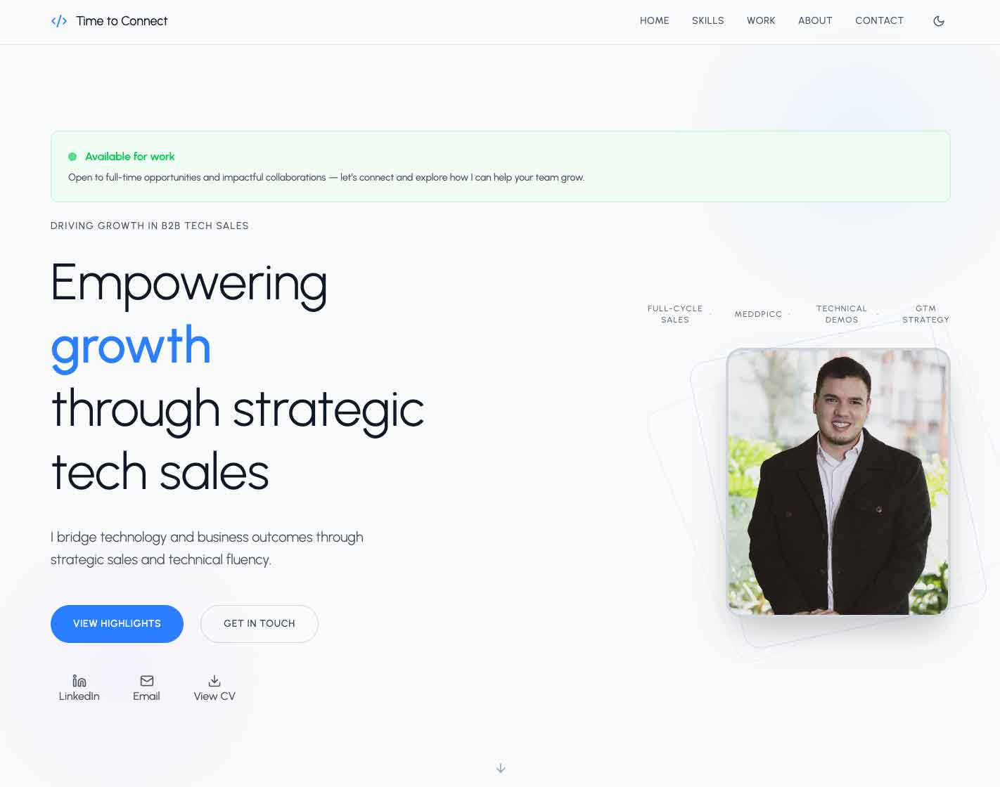

# 💼 Camilo Beltrán – Personal Portfolio

A modern, responsive personal website to showcase my experience, professional journey, and key achievements in the world of B2B tech sales across LATAM & the Caribbean.

## ✨ Overview

This portfolio was designed to go beyond the typical "developer card site" by blending technical clarity with a sales-driven narrative. It highlights my unique blend of engineering knowledge and commercial leadership.

Built with:

- ⚡️ [Vite](https://vitejs.dev/) – fast frontend tooling
- ⚛️ [React](https://reactjs.org/) – UI components
- 🎨 [Tailwind CSS](https://tailwindcss.com/) – utility-first styling
- 🎞️ [Framer Motion](https://www.framer.com/motion/) – smooth animations
- 🌙 Dark/light mode support via context

## 📁 Project Structure

```bash
src/
├── assets/           # Images and logos
├── components/       # Reusable components (e.g. Navbar, Hero, Footer)
├── context/          # Theme and global state management
├── pages/            # Sections like About, Projects, Contact
├── utils/            # Animation variants and helpers & Data
├── App.jsx           # Main app layout
└── main.jsx          # Entry point
```

## 🚀 Getting Started

### 1. Clone the repository

```bash
git clone https://github.com/your-username/portfolio-camilo-beltran.git
cd portfolio-camilo-beltran
```

### 2. Install dependencies

```bash
npm install
```

### 3. Start the development server

```bash
npm run dev
```

Your site should be running at `http://localhost:5173`

---

## 📦 Deployment

This project uses environment-based configuration to support deployment on both GitHub Pages and custom domains.

### 🔨 1. Build the project (Production Mode)

```bash
npm run build -- --mode=production
```

This will:
- Use `.env.production` to set the correct `VITE_BASE_URL`
- Output the production-ready files into the `dist/` folder

### 🧪 2. Preview the production build locally

```bash
npm run preview
```

This starts a local server at `http://localhost:4173`

### 🚀 3. Deploy to GitHub Pages

Make sure your `package.json` includes these scripts:

```json
"scripts": {
  "predeploy": "npm run build -- --mode=production",
  "deploy": "gh-pages -d dist"
}
```

To deploy:

```bash
npm run deploy
```

> This publishes the contents of the `dist` folder to the `gh-pages` branch.

### 🌐 Custom Domain

If using a custom domain (e.g. `www.camilo.com`):

1. Set `VITE_BASE_URL=/` in `.env.production`
2. Add a `CNAME` file in the `public/` folder with your domain name:
   ```
   www.camilo.com
   ```
3. Configure your DNS to point to GitHub’s IPs (or CNAME to `cabeltran10.github.io`)

---

## 🧩 Features

- Dark/light theme toggle
- Animated skill bars and career journey
- Fully customizable via JSON-like data files
- Responsive layout for mobile and desktop
- Visual storytelling through projects, milestones, and stats

## 📸 Preview



## 🛠️ Customization

Update your personal details and data in:

- `src/data/stats.js`
- `src/data/skills.js`
- `src/data/projects.js`
- `src/data/journey.js`
- `src/data/socials.js`

Replace favicon:

```html
<!-- public/index.html -->
<link rel="icon" type="image/svg+xml" href="/your-logo.svg" />
```

## 📄 License

This project is open source under the [MIT License](LICENSE).

---

> Built by [Camilo Beltrán](https://www.linkedin.com/in/camilo-beltran-jimenez/)
